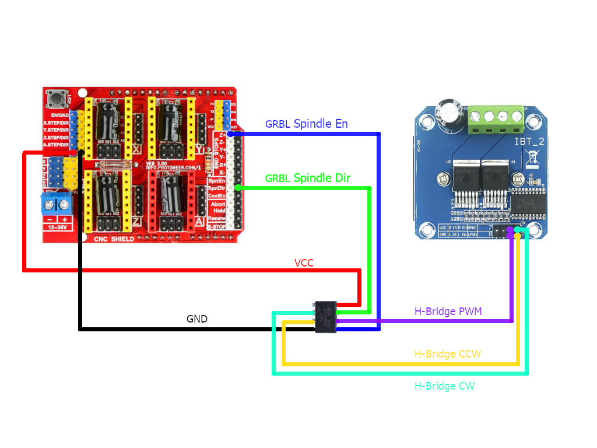

# GRBL_HBridge
Arduino Sketch to implement a simple and cheap H-Bridge adaption for [GRBL](https://github.com/grbl/grbl).\
Includes configurable soft start and soft stop for the spindle motor and seperated direction signals.

<br />

## Description
The GRBL controller is designed to dynamically control the spindle motor of an CNC router using a PWM signal output on the `Spindle Enable` pin and a digital signal output on the `Spindle Direction` pin.\
H-Bridges often are controlled with a PWM signal input and a seperate input pins for selecting clockwise or counter-clockwise direction.

<br />

This GRBL_HBridge Arduino sketch adds the capability for

- soft start of spindle
- soft stop of spindle
- soft transition between two spindle speeds
- seperate pins for cc and ccw direction
- possibility of inverting cc and ccw pin

<br />

This code is originally designed to run on an ATTiny85 microcontroller. It fits the smallest version of ATTiny85 (2048 bytes program storage space, 128 bytes dynamic memory) and makes it possible to realize a simple H-Bridge adaption with improved spindle control for small money and without much effort.

<br />

Of course you can run this code on every development board you want to.\
The configuration is done with the `Config.h` file.\
There, it's possible to adjust the **pin mapping** as well as the **soft start**, **soft stop** and **soft transition timespans**.

<br />

## Prerequisite

You should have a working GRBL controller **and** the variable spindle mode should be activated.\
Consult the [GRBL Documentation](https://github.com/grbl/grbl/wiki) on how to do this.

<br />

## Installation

_(Default)_

### Pins

The default pin mapping of GRBL_HBridge for an **ATTiny85** microcontroller.

<br />


A good throw is to connect VCC to +5V. You can use a 5V pin of the GRBL controller for this.\
If you use another voltage level for VCC, you may end up needing some kind of level shifting between GRBL controller and GRBL_HBridge and H-Bridge. I can't think of a situation, where this makes sense but if you do so, you will know why you do so.\
I guess.

**Note**:\
Mind that `H-Bridge PWM` pin has to be capable of PWM.

<br />

### Wiring

The default wiring of GRBL_HBridge when using a **BTS7960** H-Bridge.



No additional parts are strictly needed.\
If you feel like having an extra-super-good day, you can add a 100nF ceramic capacitor between VCC and GND of the ATTiny (if using one) as close to the controller as possible. It's good practice but not absolutely necessary, just _nice-to-have_.

**Note**:\
When the variable spindle mode is active, the `END STOPS Z+/-` pin and the `SpnEn` pin of the GRBL controller are swapped.

<br />

### Flash

The default controller, which this code was designed for, is an ATTiny85.\
But there are no dependencies to external libraries and GRBL_HBridge uses only standard functionality of the Arduino IDE, so it should run on every development board, which is adapted to Arduino Core.

<br />

For flashing the code to an ATTiny85, you can use an Arduino Uno (or any other board) as ISP programmer.\
Some tutorials on how to get this done:

- [Tutorial on Instructables](https://www.instructables.com/How-to-Program-an-Attiny85-From-an-Arduino-Uno/) by _NemesisC_
- [Tutorial on Wolles Elektronikkiste](https://wolles-elektronikkiste.de/en/programming-attiny-with-arduino-code) by _Wolfgang Ewald_ (English and German version)
- [Tutorial on Arduino Project Hub](https://projecthub.arduino.cc/alaspuresujay/use-an-attiny85-with-arduino-ide-d847c5) by _alaspuresujay_
  
<br />

After setup of a suitable programmer you could (for example) add [ATTinyCore ](https://github.com/SpenceKonde/ATTinyCore) by _Spence Konde_ to the Arduino IDE for support of ATTiny controllers family. This is the Arduino Core adaption I used for developing.

From this point it's very straight forward ...

1. Download the `GRBL_HBridge` directory of this repository
2. Edit the `Config.h`file to fit your needs
3. Compile and flash `GRBL_HBridge.ino` to the controller or development board

<br />

### What else is to do?

There is no need for any other steps.\
Just connect the controller or board to your GRBL controller and H-Bridge and it's ready for use.

<br />

**You have done!**

<br />

## Configuration

### Preview from `Config.h`

The following code is the basic configuration, which should be set by you.\
What is shown here, are the default values.

```cpp
/*
  SOFT_START [Milliseconds]
  Timespan on which the spindle start is
  expanded.

  SOFT_STOP [Milliseconds]
  Timespan on which the spindle stop is
  expanded.

  SOFT_TRANSITION [Milliseconds]
  Timespan on which the spindle speed change is
  expanded from one value to another, which are
  both not zero.
*/

#define   SOFT_START            1000
#define   SOFT_STOP             1000
#define   SOFT_TRANSITION       1000


/*
  PIN_GRBL_SPINDLE_EN [Input Pin]
  Spindle Enable Pin of the GRBL controller.

  PIN_GRBL_SPINDLE_DIR [Input Pin]
  Spindle Direction Pin of the GRBL controller.

  PIN_H_BRIDGE_PWM [Output Pin]
  PWM Pin of the H-Bridge. This is where the SOFT_x
  values take place.
  ATTENTION:
  This pin has to be PWM capable!

  PIN_H_BRIDGE_CW [Output Pin]
  Clockwise Direction Pin of the H-Bridge.
  By default, this value is the inverted value of
  PIN_GRBL_SPINDLE_DIR.

  PIN_H_BRIDGE_CW [Output Pin]
  Counter-Clockwise Direction Pin of the H-Bridge.
  By default, this value is the not inverted value of
  PIN_GRBL_SPINDLE_DIR.

  (The default definition of pins fits an ATTiny85)
*/

#define   PIN_GRBL_SPINDLE_EN   PB0
#define   PIN_GRBL_SPINDLE_DIR  PB2

#define   PIN_H_BRIDGE_PWM      PB1
#define   PIN_H_BRIDGE_CW       PB3
#define   PIN_H_BRIDGE_CCW      PB4


/*
  INVERT_DIRECTION [Bool]
  If 'true', the output of PIN_H_BRIDGE_CW
  and PIN_H_BRIDGE_CCW are inverted.
*/

#define   INVERT_DIRECTION      false
```

More configuration is possible.\
Please study the `Config.h` file for more information.

<br />

## Implementation and Limitations

The soft start, soft stop and soft transition is done by reading the duty of the PWM signal of the pin controlling the spindle speed defined by the GRBL controller. Some software sided dragging is added to changes of the PWM duty and this signal is then given to the PWM output pin of GRBL_HBridge, which is defined for controlling the spindle speed.

<br />

The reading of the PWM duty is implemented with the `pulseIn()` function of Arduino Core library. This leads to reading in a `HIGH` pulse with a **minimal length of 1 microsecond**.\
But as you can read in the [Arduino Reference](https://www.arduino.cc/reference/en/language/functions/advanced-io/pulsein/), the `pulseIn()` function only works properly with pulse lengths of 10 microseconds and more.

<br />

The default PWM frequency of GRBL is 977Hz.\
With the default minimal PWM duty of $\frac{1}{255}$, the minimal PWM pulse length is:

$\frac{1}{977Hz} \cdot \frac{1}{255} = 4{\mu}s$

<br />

This means that the soft start, stoft stop and soft transition may will be kind of _sloppy_ at spindle speeds slower as the following percentage of the maximum spindle speed:

$\frac{10{\mu}s}{4{\mu}s} \cdot \frac{1}{255} \cdot 100\\% = 1\\%$

<br />

## License

GRBL_HBridge is published under the terms of **GNU General Public License v3.0** to ensure conformity with the GRBL project.

<br />

## Contributing

Some testing and feedback would be very helpful.
